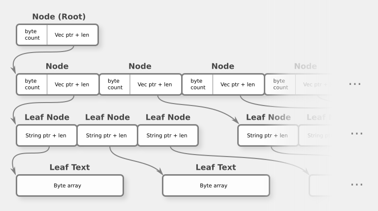
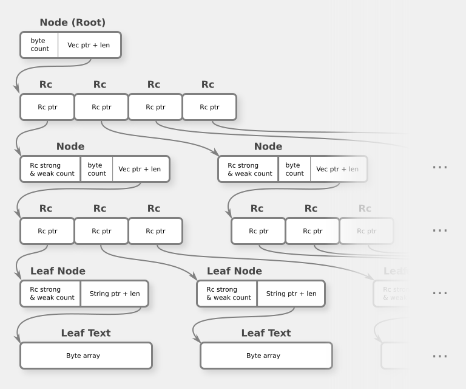
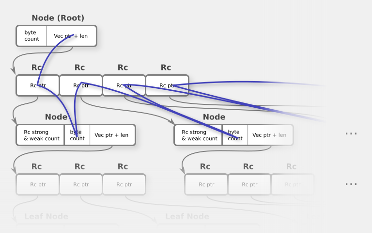
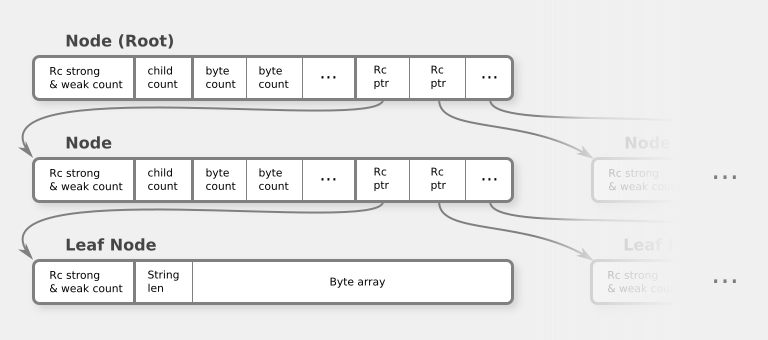

# Ropey's Design

This document is an overview of Ropey's technical design.  It is primarily targeted at potential contributors, to help get up-to-speed with the codebase.  But it may also be of interest to users of the library and the generally-curious.

This document assumes prior knowledge of [ropes](https://en.wikipedia.org/wiki/Rope_(data_structure)) and [b-trees](https://en.wikipedia.org/wiki/B-tree).


## Directory Structure

Public-facing:

- `src/rope.rs`: the high-level implementation of `Rope`.
- `src/slice.rs`: implementation of `RopeSlice`.
- `src/iter.rs`: implementations of all the iterators.
- `src/rope_builder.rs`: implementation of `RopeBuilder`.
- `src/str_utils.rs`: utility functions that operate on `&str` slices.  For example, functions to count chars and line endings.

Internal-only:
- `src/tree/`: the low-level implementation of `Rope`'s internals, where most of the meat of the b-tree rope is.


## B-tree Rope

The core data structure in Ropey is a b-tree rope.  This data-structure was chosen for several reasons:

- It has good random-access editing performance.  [Gap buffers](https://en.wikipedia.org/wiki/Gap_buffer) are another popular choice of data structure for text editing, but they perform poorly on random-access edits.  Multiple-cursor support is common in code editors, so being able to efficiently edit at many locations simultaneously is important.
- It can naturally track `char` indices and line endings.  Most other data structures require additional external data structures to track such information.
- B-trees minimize pointer indirection and make traversal patterns more coherent when properly implemented. This is important for performing well with modern memory architectures and large data sets.

Ropey's b-tree nodes are primarily implemented in three files:

- `src/tree/node_text.rs`: implementation of `NodeText`, a small string for storing text in leaf nodes.
- `src/tree/node_children.rs`: implementation of `NodeChildren`, a fixed-capacity vec for storing child meta-data and child pointers in internal nodes.
- `src/tree/node.rs`: the main `Node` implementation, which is just an `enum` with the above two types as its leaf node and internal node variants.


## Memory Layout

The structures in Ropey's rope implementation have been carefully designed to:

1. Minimize pointer chasing.
2. Make it easy for memory allocators to compactly store nodes.
3. Make it easy for memory allocators to compactly place new nodes in the space vacated by old freed nodes.

To motivate the design a bit, let's explore what a naive implementation of a b-tree rope might look like.  And for simplicity, let's only track bytes in the rope, not chars or line endings.  It could be implemented as a single `enum`, like this:

``` Rust
enum Node {
    Internal {
        byte_count: usize,
        Vec<Node>,
    },
    Leaf(String),
}
```

And in memory, it looks something like this (touching boxes represent contiguous areas of memory, arrows represent pointers):



There are a couple of things about this that aren't great:

- Leaf nodes have an extra level of indirection to get to their text data.
- Although the children of a node are all stored contiguously in memory (good for memory locality), the size of that contiguous space varies because of the varying number of children.  The memory allocated for leaf text also varies in size.  This can lead to memory fragmentation when holes in memory are left that are too small to use for subsequent sets of children or leaf text.

Having said that, this is actually a pretty decent design!  The fragmentation is (fingers crossed) unlikely to be a major issue with a decent allocator.  And the extra level of indirection only happens at the very bottom of the tree, so you won't accumulate additional unnecessary indirection as the tree grows.

But one of Ropey's design goals is to share data between Rope clones to make cloning cheap.  This means that every child needs to be kept under something like a reference-counted smart pointer so it can be shared between trees.  What happens if we do that?

``` Rust
enum Node {
    Internal {
        byte_count: usize,
        Vec<Rc<Node>>,
    },
    Leaf(String),
}
```



Suddenly things are a lot worse off:

- We have an extra level of memory indirection _at every level of the tree_, and _two_ levels of indirection at the leaf nodes.
- We no longer have good memory locality: children are all over the place along with their meta-data.

This is bad for both performance and compact memory usage.  Even just choosing which child to traverse into requires jumping all over the place in memory, because you have to check the children's metadata:



Ropey addresses this in two ways.  First, it stores child meta-data in the _parent_ node in a coherent array.  This allows fast scanning to decide which child to traverse into.  And second, it inlines the leaf's string data into the enum.  A simplified (and not-quite-actually-workable) version of that approach looks like this:

``` Rust
enum Node {
    Internal {
        child_count: u8,
        child_byte_counts: [usize; 4],  // Max four children
        children: [Rc<Node>; 4],  // Max four children
    },
    Leaf {
        len: usize,
        [u8; 100],  // Max 100 bytes of text per leaf
    },
}
```



Now we've eliminated all unnecessary indirection and we've kept all metadata coherent in memory for fast scanning.  And (bonus!) all nodes are exactly the same size, including leaf text data.  This makes things really easy for the memory allocator.

This is essentially Ropey's design, but implemented with a bit more sophistication.  The main differences from Ropey's actual implementation are:

- Ropey tracks char count and line-ending count in addition to byte count.
- Ropey wraps the details of the internal and leaf variants in separate types that both have a bit more sophistication.
- Ropey uses `Arc` instead of `Rc`, so clones can be sent between threads.

But by-and-large, Ropey's memory layout is essentially identical to the code snippet above.

One final piece of the puzzle: since the inlined leaf text and the child pointers/metadata are both crammed into the same enum, they should both be sized to take up roughly the same amount of space to minimize unused bytes.  Moreover, allocators work best with sizes in the multiples of large-ish powers of two.  That's what all the weird calculations for the `MAX_*` constants in `src/tree/mod.rs` are doing.

Phew!  Hopefully that all made sense.


## Traversal and Mutation

Most of the logic for traversing and modifying the tree is implemented in `node.rs` as part of `Node`.  As a general rule, code that needs to know which node is root is implemented in `Rope`, code that otherwise traverses or modifies the tree is implemented in `Node`, and code that only deals with a single node is implemented in `NodeText` and `NodeChildren`.

The five main functions to really pay attention to are part of `Node`:

- `Node::edit_chunk_at_char()`
- `Node::remove_char_range()`
- `Node::split()`
- `Node::prepend_at_depth()`
- `Node::append_at_depth()`.

These are by far the most complex code in Ropey, and are the core editing operations which the `Rope` type uses to implement its own editing operations.  Be very careful when modifying them and their helper methods, as there are many invariants that must be held for everything to work properly.  Ropey has a lot of unit tests, so running `cargo test` is a useful way to help minimize the chances that you break something, but don't depend on that entirely.


## Tree Invariants

The following invariants must hold true for the tree to operate correctly:

- The standard b-tree invariants:
    - All leaf nodes must be at the same depth.
    - Internal nodes must have at least `MIN_CHILDREN` and at most `MAX_CHILDREN`, except for the root which can have as few as two children.
- All child meta-data must be accurate.
- Leaf nodes must never be empty, except for the root node when it is a leaf.
- CRLF pairs must never be split by a leaf node boundary.  Otherwise the code for counting line endings won't work properly.

There are some hidden-from-documentation methods on `Rope` that check for and assert these invariants:

- `Rope:assert_integrity()`: checks for basic child meta-data integrity.  This is _the most important_ check, as things will break in crazy ways if this isn't true.  If you get really strange behavior from the tree, this is the first thing to check.
- `Rope::assert_invariants()`: checks that the rest of the invariants listed above hold true.  If you get panics or weird performance degradation, this is the second thing to check.

(Note: these methods are for debugging while working on Ropey, and are expliclty _not_ part of Ropey's external API promise.  They are doc-hidden for a reason.)

There is one final "invariant" that should _generally_ hold true, but doesn't strictly need to for correct operation and _may_ be violated under some circumstances:

- Leaf nodes should _generally_ not contain less than `MIN_BYTES` of text or more than `MAX_BYTES` of text.

There are two cases where this invariant might not hold true:

1. When the root node is a leaf, it may contain less than `MIN_BYTES` of text.
2. If the text begins or ends with a CRLF pair that just pushed it over the edge in specific circumstances, then the leaf node that contains it must exceed `MAX_BYTES` to avoid splitting it.  This should be extremely rare.

In practice, case 2 is vanishingly unlikely to ever happen in real (and non-broken) text.  Nevertheless, it needs to be handled correctly by all code.


## Rope Clones and Thread Safety

Ropey shares data between `Rope` clones.  The approach taken for this is very simple: all nodes are wrapped in an `Arc`, and when we need to modify a node we always use `Arc::make_mut()` to access it for mutation.  `Arc::make_mut()` will provide mutable access to the node if there is only one owner, but will make a clone of the node and have you mutate that instead if ownership is shared.  This automatically leads to a thread-safe shared-data model, where nodes have copy-on-write semantics but do the more efficient in-place mutation when their ownership is not shared.

The main implication of this when working on Ropey's codebase is pretty simple: make sure to always use `Arc::make_mut()` when accessing nodes for mutation, never `Arc::get_mut()`.


## Unsafe Code

Ropey uses a fair bit of unsafe code.  The vast majority of it is in the implementations of `NodeChildren`, `NodeText`, and a handful of hot functions in `str_utils.rs`.

Reducing and/or better isolating the unsafe code in Ropey would be great, and pull requests along those lines are more than welcome.  However, it shouldn't be at the expense of performance or memory overhead--at least, not significantly so.

Reviews, fuzz testing, etc. of the existing unsafe code are also extremely welcome.  The more eyes and tests we have on it, the better!
